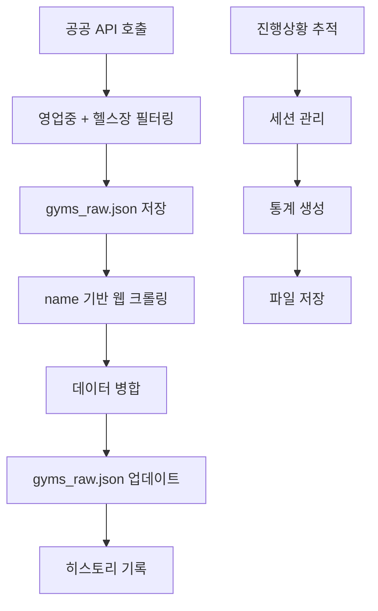

# 향상된 크롤링 시스템 가이드

## 📋 개요

이 문서는 개선된 크롤링 시스템의 구조, 기능, 사용법을 설명합니다. 새로운 시스템은 다음과 같은 요구사항을 충족합니다:

1. **API 호출 시 영업중이고 gym/gx/pt/크로스핏 타입만 필터링**
2. **gyms_raw.json의 name 값으로 인터넷 크롤링**
3. **크롤링된 데이터와 gyms_raw 데이터 병합**
4. **진행사항 문서화 및 히스토리 추적**

## 🏗️ 시스템 구조

### 1. 핵심 컴포넌트

```
src/backend/modules/crawling/
├── core/
│   └── CrawlingService.ts          # 메인 크롤링 서비스
├── sources/
│   ├── PublicApiSource.ts          # 공공 API 데이터 수집 (필터링 포함)
│   ├── WebCrawlingSource.ts        # 웹 크롤링 (레거시)
│   └── GymNameCrawlingSource.ts    # name 기반 크롤링 (신규)
├── processors/
│   ├── DataProcessor.ts            # 데이터 처리
│   ├── DataMerger.ts               # 기본 데이터 병합
│   └── EnhancedDataMerger.ts       # 향상된 데이터 병합 (신규)
├── tracking/
│   └── CrawlingHistoryTracker.ts   # 히스토리 추적 (신규)
└── types/
    └── CrawlingTypes.ts            # 타입 정의
```

### 2. 데이터 흐름



## 🔧 주요 기능

### 1. 공공 API 필터링 (PublicApiSource.ts)

**기능:**
- 서울시 공공데이터 API에서 헬스장 관련 시설만 필터링
- 현재 영업중인 시설만 수집
- gym, gx, pt, 크로스핏, 요가, 필라테스 등 헬스장 관련 키워드 필터링

**필터링 로직:**
```typescript
// 헬스장 관련 키워드
const gymKeywords = [
  '헬스', '헬스장', '피트니스', 'fitness', 'gym', '짐',
  '크로스핏', 'crossfit', 'cross fit',
  'pt', 'personal training', '개인트레이닝',
  'gx', 'group exercise', '그룹운동',
  '요가', 'yoga', '필라테스', 'pilates',
  '웨이트', 'weight', '근력', 'muscle',
  '체육관', '운동', 'exercise'
]

// 영업시간 확인
const isCurrentlyOpen = (item) => {
  const now = new Date()
  const currentTime = now.getHours() * 60 + now.getMinutes()
  
  if (item.SVCOPNBGNDT && item.SVCOPNENDDT) {
    const openTime = parseTime(item.SVCOPNBGNDT)
    const closeTime = parseTime(item.SVCOPNENDDT)
    return currentTime >= openTime && currentTime <= closeTime
  }
  
  return true // 정보가 없으면 영업중으로 간주
}
```

### 2. Name 기반 크롤링 (GymNameCrawlingSource.ts)

**기능:**
- gyms_raw.json의 name 값으로 인터넷 검색
- 네이버, 구글, 다음에서 헬스장 정보 수집
- Rate limiting 및 오류 처리
- 실시간 진행상황 추적

**크롤링 프로세스:**
```typescript
async crawlGymsFromRawData(gymsRawData: any[]): Promise<ProcessedGymData[]> {
  // 1. gyms_raw.json 데이터 로드
  // 2. 각 헬스장에 대해 순차적으로 크롤링
  // 3. 여러 검색 엔진에서 시도
  // 4. 원본 데이터와 크롤링 데이터 병합
  // 5. 진행상황 실시간 업데이트
}
```

### 3. 향상된 데이터 병합 (EnhancedDataMerger.ts)

**기능:**
- 원본 데이터와 크롤링 데이터의 지능적 병합
- 유사도 기반 매칭 (Levenshtein 거리)
- 충돌 해결 전략
- 품질 점수 계산

**병합 로직:**
```typescript
// 유사도 계산
const calculateSimilarity = (original, crawled) => {
  let similarity = 0
  let factors = 0

  // 이름 유사도 (50% 가중치)
  if (original.name && crawled.name) {
    const nameSimilarity = calculateStringSimilarity(
      original.name.toLowerCase(),
      crawled.name.toLowerCase()
    )
    similarity += nameSimilarity * 0.5
    factors += 0.5
  }

  // 주소 유사도 (30% 가중치)
  if (original.address && crawled.address) {
    const addressSimilarity = calculateStringSimilarity(
      original.address.toLowerCase(),
      crawled.address.toLowerCase()
    )
    similarity += addressSimilarity * 0.3
    factors += 0.3
  }

  // 전화번호 일치 (20% 가중치)
  if (original.phone && crawled.phone) {
    const phoneMatch = original.phone === crawled.phone ? 1 : 0
    similarity += phoneMatch * 0.2
    factors += 0.2
  }

  return factors > 0 ? similarity / factors : 0
}
```

### 4. 히스토리 추적 (CrawlingHistoryTracker.ts)

**기능:**
- 크롤링 세션 관리
- 실시간 진행상황 추적
- 오류 및 경고 기록
- 통계 생성 및 저장

**세션 구조:**
```typescript
interface CrawlingSession {
  id: string
  startTime: Date
  endTime?: Date
  status: 'running' | 'completed' | 'failed' | 'cancelled'
  totalSteps: number
  completedSteps: number
  currentStep?: string
  progress: {
    current: number
    total: number
    percentage: number
  }
  results: {
    publicApiGyms: number
    crawlingGyms: number
    mergedGyms: number
    totalGyms: number
    qualityScore: number
  }
  errors: string[]
  warnings: string[]
  history: CrawlingHistoryEntry[]
}
```

## 🚀 사용법

### 1. 기본 크롤링 실행

```typescript
import { getCrawlingService } from '../services/crawlingService'
import { getRepository } from 'typeorm'
import { Gym } from '../entities/Gym'

const gymRepo = getRepository(Gym)
const crawlingService = getCrawlingService(gymRepo)

// 통합 크롤링 실행
const result = await crawlingService.executeIntegratedCrawling()
console.log('크롤링 결과:', result)
```

### 2. 진행상황 모니터링

```typescript
// 현재 상태 조회
const status = crawlingService.getStatus()
const progress = crawlingService.getCrawlingProgress()

// 현재 세션 조회
const currentSession = crawlingService.getCurrentSession()

// 최근 세션 목록
const recentSessions = crawlingService.getRecentSessions(10)

// 통계 조회
const statistics = crawlingService.getSessionStatistics()
```

### 3. API 엔드포인트

#### 크롤링 실행
```http
POST /api/enhanced-gym/update-data
```

#### 상태 조회
```http
GET /api/enhanced-gym/status
```

#### 세션 목록
```http
GET /api/enhanced-gym/sessions?limit=10
```

#### 특정 세션 조회
```http
GET /api/enhanced-gym/sessions/{sessionId}
```

#### 통계 조회
```http
GET /api/enhanced-gym/statistics
```

#### 현재 세션 조회
```http
GET /api/enhanced-gym/current-session
```

## 📊 데이터 구조

### gyms_raw.json 구조

```json
[
  {
    "id": "CDFH3301062024000002",
    "name": "국대교정",
    "type": "짐",
    "address": "서울특별시 용산구 장문로 14, 우성빌딩 3층 (동빙고동)",
    "phone": "0507-1354-3136",
    "latitude": -89.9364514346111,
    "longitude": 343.9102682502384,
    "is24Hours": false,
    "hasParking": false,
    "hasShower": false,
    "createdAt": "2025-08-04T02:58:10.601Z",
    "updatedAt": "2025-08-04T02:58:10.601Z",
    
    // 크롤링에서 추가된 정보
    "rating": 4.5,
    "reviewCount": 23,
    "source": "naver_place",
    "confidence": 0.8,
    "serviceType": "gym",
    "isCurrentlyOpen": true,
    "crawledAt": "2025-01-10T10:30:00.000Z"
  }
]
```

### ProcessedGymData 타입

```typescript
interface ProcessedGymData {
  id?: number | string
  name: string
  address: string
  phone?: string
  latitude?: number
  longitude?: number
  facilities?: string
  openHour?: string
  closeHour?: string
  price?: string
  rating?: number
  reviewCount?: number
  source: string
  confidence: number
  type?: string
  is24Hours?: boolean
  hasGX?: boolean
  hasPT?: boolean
  hasGroupPT?: boolean
  hasParking?: boolean
  hasShower?: boolean
  equipment?: ProcessedEquipmentData[]
  createdAt?: Date | string
  updatedAt?: Date | string
  
  // 새로운 필드들
  serviceType?: string
  isCurrentlyOpen?: boolean
  crawledAt?: string
}
```

## 🔍 모니터링 및 디버깅

### 1. 로그 확인

```bash
# 백엔드 로그 확인
tail -f logs/backend-combined-0.log

# 크롤링 관련 로그 필터링
grep "크롤링\|crawling" logs/backend-combined-0.log
```

### 2. 히스토리 파일 확인

```bash
# 크롤링 히스토리 확인
cat src/backend/logs/crawling-history.json
```

### 3. 진행상황 실시간 모니터링

```typescript
// 5초마다 진행상황 확인
setInterval(async () => {
  const progress = crawlingService.getCrawlingProgress()
  console.log(`진행률: ${progress.percentage}% (${progress.current}/${progress.total})`)
  console.log(`현재 처리 중: ${progress.currentGym}`)
}, 5000)
```

## ⚠️ 주의사항

### 1. Rate Limiting
- 각 검색 엔진마다 요청 간 3초 지연
- 동시 요청 수 제한 (1개)
- 429 오류 시 지수 백오프 적용

### 2. 오류 처리
- 크롤링 실패 시 원본 데이터 사용
- 네트워크 오류 시 재시도 (최대 2회)
- 모든 오류는 히스토리에 기록

### 3. 데이터 품질
- 유사도 임계값: 0.8 (80% 이상 일치 시 같은 헬스장으로 간주)
- 품질 점수: 0.7 이상 권장
- 충돌 발생 시 더 완전한 데이터 우선 선택

## 🚀 성능 최적화

### 1. 배치 처리
- 기본 배치 크기: 5개 헬스장
- 배치 간 지연: 10초
- 메모리 사용량 최적화

### 2. 캐싱
- 세션 데이터 메모리 캐싱
- 히스토리 파일 기반 영속성
- 중복 요청 방지

### 3. 병렬 처리
- 검색 엔진별 순차 처리
- 데이터 병합 시 병렬 처리
- I/O 작업 비동기 처리

## 📈 확장성

### 1. 새로운 검색 엔진 추가
```typescript
// GymNameCrawlingSource.ts에 새로운 검색 메서드 추가
private async searchNewEngine(gymName: string, address?: string): Promise<ProcessedGymData | null> {
  // 새로운 검색 엔진 로직 구현
}

// searchEngines 배열에 추가
const searchEngines = [
  () => this.searchNaver(gymName, address),
  () => this.searchGoogle(gymName, address),
  () => this.searchDaum(gymName, address),
  () => this.searchNewEngine(gymName, address) // 새 엔진 추가
]
```

### 2. 새로운 데이터 소스 추가
```typescript
// PublicApiSource.ts에 새로운 API 추가
async fetchFromNewAPI(): Promise<ProcessedGymData[]> {
  // 새로운 공공 API 호출 로직
}

// fetchAllPublicAPIData 메서드에 통합
async fetchAllPublicAPIData(): Promise<ProcessedGymData[]> {
  const seoulData = await this.fetchFromSeoulAPI()
  const newApiData = await this.fetchFromNewAPI() // 새 API 추가
  
  return [...seoulData, ...newApiData]
}
```

### 3. 새로운 필터링 조건 추가
```typescript
// PublicApiSource.ts의 isGymRelatedService 메서드 확장
private isGymRelatedService(serviceName: string, serviceType: string): boolean {
  const gymKeywords = [
    // 기존 키워드들...
    '새로운키워드', 'new_keyword' // 새 키워드 추가
  ]
  
  // 새로운 필터링 로직 추가
  const hasNewCondition = this.checkNewCondition(serviceName, serviceType)
  
  return gymKeywords.some(keyword => combinedText.includes(keyword)) || hasNewCondition
}
```

## 🔧 설정

### 환경 변수
```bash
# 서울시 공공데이터 API 키
SEOUL_OPENAPI_KEY=your_api_key_here

# 크롤링 설정
CRAWLING_BATCH_SIZE=5
CRAWLING_DELAY=3000
CRAWLING_MAX_RETRIES=2
CRAWLING_TIMEOUT=20000
```

### 설정 파일
```typescript
// CrawlingService.ts의 config 객체 수정
this.config = {
  enablePublicApi: true,
  enableCrawling: true,
  enableDataMerging: true,
  enableQualityCheck: true,
  batchSize: 5,
  maxConcurrentRequests: 1,
  delayBetweenBatches: 10000,
  maxRetries: 3,
  timeout: 30000,
  saveToFile: true,
  saveToDatabase: true
}
```

## 📝 변경 이력

### v2.0.0 (2025-01-10)
- ✅ API 호출 시 영업중이고 gym/gx/pt/크로스핏 타입만 필터링
- ✅ gyms_raw.json의 name 값으로 인터넷 크롤링 구현
- ✅ 크롤링된 데이터와 gyms_raw 데이터 병합 로직 구현
- ✅ 진행사항 문서화 및 히스토리 추적 시스템 구현
- ✅ 향상된 데이터 병합 알고리즘
- ✅ 실시간 진행상황 모니터링
- ✅ 세션 기반 히스토리 관리
- ✅ API 엔드포인트 확장

### v1.0.0 (이전 버전)
- 기본 공공 API 크롤링
- 단순 데이터 병합
- 기본 오류 처리

## 🤝 기여

새로운 기능이나 개선사항이 있다면 다음 단계를 따라주세요:

1. 이슈 생성
2. 브랜치 생성
3. 코드 작성 및 테스트
4. 문서 업데이트
5. Pull Request 생성

## 📞 지원

문제가 발생하거나 질문이 있으시면:

1. 로그 파일 확인
2. 히스토리 파일 확인
3. API 엔드포인트 테스트
4. 개발팀에 문의

---

**마지막 업데이트:** 2025-01-10  
**버전:** 2.0.0  
**작성자:** 개발팀
